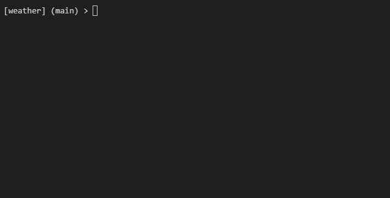

# Weather CLI

A terminal-based Python app that fetches real-time **NOAA weather**, **UV Index**, and **Air Quality (AQI)** for any location — displayed as a Rich UI in your terminal and logged to CSV.



## Features

- Live weather loop — fetches current conditions every 30 minutes
- 6-period forecast digest — see the next 6 NOAA periods at a glance
- UV Index via Open-Meteo
- US AQI via Open-Meteo Air Quality API
- Color-coded AQI categories (Good → Hazardous)
- CSV logging with timestamped rows
- Non-interactive mode via `--location` flag

## Install

```bash
pip install -r requirements.txt
```

## Usage

```bash
# Interactive live loop (prompts for location)
python main.py

# Live loop with location flag (no prompt)
python main.py -l "San Francisco, CA"

# One-shot 6-period forecast digest
python main.py --digest -l "San Francisco, CA"

# Digest that refreshes every 6 hours
python main.py --digest --watch -l "San Francisco, CA"
```

## CLI Flags

| Flag | Short | Description |
|---|---|---|
| `--location` | `-l` | Location string, skips interactive prompt |
| `--digest` | | Print 6-period forecast digest |
| `--watch` | | Use with `--digest` to refresh every 6 hours |

## Files

| File | Description |
|---|---|
| `main.py` | Entry point, Rich UI, CSV logging, argparse |
| `forecast_digest.py` | Fetches and normalizes 6 NOAA forecast periods |
| `geocode_location.py` | Geocodes location strings via Nominatim |
| `test_weather.py` | 21 unit tests (pytest) |
| `weather_log.csv` | Auto-generated CSV log |

## Run Tests

```bash
python -m pytest test_weather.py -v
```

## APIs Used

- [NOAA Weather API](https://www.weather.gov/documentation/services-web-api) — forecast data
- [Open-Meteo](https://open-meteo.com) — UV Index
- [Open-Meteo Air Quality](https://open-meteo.com/en/docs/air-quality-api) — US AQI
- [Nominatim (OpenStreetMap)](https://nominatim.org) — geocoding

## Requirements

- Python 3.10+
- `requests`
- `rich`
